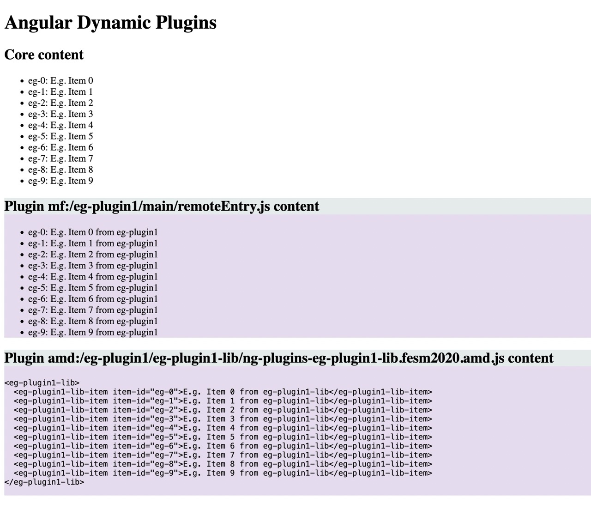

# ngx-plugins

This project is an example of a dynamic plugin architecture for [Angular](https://angular.io) apps.  The architecture consists of a host application, a shared library with services and/or components that the host application both consumes and exposes to plugins, and one or more plugin libraries that the host app can load dynamically based on external configuration.

The host app and shared library exist in one [Angular CLI workspace](https://angular.io/cli) so
developers can maintain those elements concurrently.  The plugins can reside in separate code
repositories in their own Angular CLI workspace.  The plugin references the host shared
library as a dependency and can interact and extend the host app via whatever services and hooks
the host app requirements dictate and provides through the shared library APIs.

This example project draws inspiration from the [fine work](https://indepth.dev/posts/1263/building-an-extensible-dynamic-pluggable-enterprise-application-with-angular) of
[@alexzuza](https://github.com/alexzuza/angular-plugin-architecture) and [@jfgouda](https://github.com/jfgouda/angular-plugin-architecture).
Many thanks to them for their time and contributions to the community.

## Project Structure

### `/eg-core`
This is the Angular workspace for the core web app, as well as the core library which plugins can use for development.
This contains the `angular.json` project descriptor, as well as project level configuration files.

### `/eg-core/src`
This is the root of the core web application source files.  Projects applying this Angular plugin architecture may look
better if this resided under a separate sub-project directory, e.g., `/eg-core/main`, alongside the `eg-core-lib`
sub-project.

### `/eg-core/projects/eg-core-lib`
This is the project root of the shared Angular library that contains all the service and component APIs which the host
web app provides at runtime to dynamically loaded plugins.

### `/eg-core/eg-plugin-builder`
This is the project for the custom Angular CLI builder that bundles Angular libraries from Angular's new [ESM format](https://angular.io/guide/angular-package-format)
to an AMD module that SystemJS can load at runtime.

### `/eg-core/plugins`
This is the base directory from which the Angular [dev server](./eg-core/webpack.config.js#L23) serves plugin resources statically.

### `/eg-plugin1`
This is the root Angular workspace for an example plugin project.

### `/eg-plugin1/projects/main`
This is a version of `eg-plugin1` implemented using Webpack-based Module Federation (see [below](#transition-to-module-federation)).
This is an Angular application project, as opposed to a library, because the Angular application builder ~~uses~~ [used](https://angular.io/guide/esbuild)
Webpack as its bundler, so the Module Federation Angular builder is based on the Angular application builder, and
packaged as a standalone application.

### `/eg-plugin1/projects/eg-plugin1-lib`
This is a version of `eg-plugin1` implemented as an Angualar library which uses a [custom builder](#eg-coreeg-plugin-builder)
to bundle the output of Angular's base library builder to an AMD module that SystemJS can load.

## Build and Run
Use Node 18+ and npm 9+.

Start from the repository root `/ngx-plugins`.
```shell
# build the plugin builder
cd eg-core/eg-plugin-builder
npm i
npm run build
# build the core packges
cd ..
npm i
# build the shared core library because the core app depends on it
npm run build eg-core-lib
# build the core host web app
npm run build eg-core
# build the plugin bundles
cd ../eg-plugin1
npm i
# link the builder locally - in a production scenario the builder package would reside in the npm registry so plugin
# projects could install with npm i normally
npm link ../eg-core/eg-plugin-builder
npm run build
```
Note that on Linux/macOS systems, symlinks in the `/eg-core/plugins` directory already point to the bundle artifacts
in `/eg-plugin1/dist`.  If you are using Windows, you might need to copy the bundles manually into the
`/eg-core/plugins` directory.

Now you can start the Angular dev server.
```shell
cd eg-core
npm start
```
You should now be able to browse to http://localhost:4200 and see a page that looks something like the following.

Beautiful, no?

## Under the Hood
The main point of interest is the core app's [`PluginService`](eg-core/src/app/plugin.service.ts).  Note that the
service imports the bare module specifiers of all shared module entry points, then registers them with the SystemJS
loader.  This enables sharing of the registered modules with plugins at runtime.  The other side of this mechanism is
the plugin build system, which must know which module specifiers the host app will share so the final plugin bundle
does not include the code for the shared modules and declares them as external dependencies.  The
[`eg-plugin-builder`](eg-core/eg-plugin-builder/src/fesm-amd.ts) handles this dependency filtering so each individual
plugin project does not need to manage this configuration.

## Angular 13+ Update
This project started with using Angular version 9.  At that time, Angular's library builder produced a UMD/AMD bundle
out of the box.  Angular 13's new [package format](https://angular.io/guide/angular-package-format) no longer
[generates UMD bundles](https://github.com/ng-packagr/ng-packagr/blob/main/CHANGELOG.md#1300-2021-11-03).
Therefore, this project needs a new way to build and dynamically load libraries in a host app.  The main output format
of ng-packagr now is the Flattened ECMAScript Module (FESM), which is essentially a concatenated bundle of the
library's transpiled JavaScript with `import` statements left intact, as Angular assumes the library will eventually
be incorporated and transpiled in a host app's build process.  With dynamic plugins, however, that is not the case.

The problem now is how to make shared libraries available from the host app to the plugin libraries at runtime.  The
app previously used SystemJS to accomplish this, because all the plugin libraries were UMD/[AMD](https://github.com/amdjs/amdjs-api/wiki/AMD)
modules and SystemJS injected the resolved shared libraries the plugins required by bare module ID, such as
`@angular/common`.  With FESM,  There is no way to inject dependency resolution for bare module IDs because the
compiled library still contains ESM import statements like `import '@angular/core'`, for which the browser natively
controls resolution.  Further, the browser has no inherent mechanism to resolve these bare IDs, so the host app must
provide an [`importmap`](https://github.com/WICG/import-maps).  An import map is conceptually similar to what the
original SystemJS plugin service accomplished by explicitly loading and registering all shared libraries so SystemJS
could provide them to plugins at runtime.  The difference is that the bundler (Angular's Webpack builder) mostly took
care of this at build time, so the transpiled plugin service actually had static references to resolved modules,
whereas an import map can only map a bare module ID to a URL, like `"@angular/core": "/shared/@angular/core"` or
`"@angular/core": "https://some.cdn/@angular/core"`.  The problem with that is now the host app build must produce
separate ESMs for every shared library module, and the browser must load them all with separate requests, rather than
an all-in-one JavaScript bundle like a non-ESM app.  With HTTP/2 enabled, the overhead of multiple module requests is
not as much of a concern because HTTP/2 multiplexing handles multiple resources on a single connection.  More research
into broad support and performance for HTTP/2 with ES modules is necessary.  Angular itself has many entry points, not
to mention Angular Material, which has even more. Some level of bundling will likely still be necessary to chunk each
entry point to the extent possible.

Alternatively to ESM/FESM and HTTP/2, Angular Architects has created the
[Module Federation](https://www.npmjs.com/package/@angular-architects/module-federation) (AAMF) plugin, which wraps
[Webpack's Module Federation](https://webpack.js.org/concepts/module-federation/) (WMF).  The AAMF plugin is a build-
time bundling tool and run-time API that more-or-less replicates the capabilities of the former SystemJS mechanism.
The drawback is that the MFP would be coupled to Angular's Webpack build chain.  This is not a significant issue
currently (2023 May), but Angular is working on a new build chain [using esbuild](https://angular.io/guide/esbuild#trying-the-esm-build-system-in-an-angular-cli-application).
Angular Architects has an updated variation of AAMF called [Native Federation](https://www.npmjs.com/package/@angular-architects/native-federation), which is build-tool-agnostic and so compatible with Angular's new (currently beta) esbuild tool chain along with browser-native ES module loading.  The new Angular esbuild system is still in beta as of Angular version 16.

In the interest of stability, the best solution right now is to use Angular Architects' Webpack-based Module Federation
Plugin.  After Angular transitions the esbuild system from beta to stable release, migrating the host application to
esbuild with Native Federation should be relatively painless.

### Transition to Module Federation
After deciding on Module Federation (MF), the task now is to transition an existing Angular library plugin to build
with the Angular Architects Module Federation (AAMF) Angular build plugin.  I started by following the steps of the
[tutorial](https://github.com/angular-architects/module-federation-plugin/blob/main/libs/mf/tutorial/tutorial.md).
In brief, I performed the following steps.
1. Add the MF Plugin to the Angular build in the `eg-core` workspace, which in MF terms is the "shell".
   ```
   cd eg-core
   ng add @angular-architects/module-federation@^14.0.0 --project eg-core --type dynamic-host --port 4200
   ```
1. Create a wrapper Angular application in the `eg-plugin1` workspace.  [See commit](d3e1629f8c542b447b0a3c490c2646572d4dec36).
   See below for an explanation of this step.
   ```
   cd eg-plugin1
   ng generate application main
   ```
1. Add the MF Plugin to the Angular build in the `eg-plugin1` workspace, which in MF terms is the "remote" or micro
   frontend (MFE).  [See commit](d47efff96ae6c18fdeed25b691c2a6942659258f).
   ```
   cd eg-plugin1
   ng add @angular-architects/module-federation@^14.0.0 --project eg-plugin1 --type remote --port 4201
   ```
1. Move the substantial `eg-plugin1` source files from the library project to the application project.
   [See commit](670f43da481a5f75cea2389c82828481a7d3bc89).
1. Add the `eg-plugin1` hook module to the TypeScript compilation in [`tsconfig.app.json`](./eg-plugin1/projects/main/tsconfig.app.json).
   [See commit](d025726314145935a778b6b66bbb58a9fe605f09).
1. Remove the import statement from the eg-plugin1 `main.ts` module that AAMF plugin schematic generated.
   [See commit](b965522531e1db21da2f54d7dc2a5152224ad496).  This avoids an error described [below](#adapting-module-federation-to-dynamic-plugins).
1. Change the exposed module in the `eg-plugin1` [webpack config](./eg-plugin1/projects/main/webpack.config.js) to reference the
   [plugin hook module](./eg-plugin1/projects/main/src/app/eg-plugin.hooks.ts).
   [See commit](56f0adc3ea9aa9a2a8f578ef1ff4298c9089154f).
1.

### Adapting Module Federation to Dynamic Plugins
Note above that the AAMF plugin expects a port parameter even for the plugin (remote MFE) project.  This is because
AAMF assumes the MFE module resides in a separate, standalone app endpoint, rather than as a resource within the shell
app's context as this plugin example project does.  This highlights a key difference between the original dynamic
plugin implementation and how AAMF works.  While the former used the Angular library project schematic, the latter
builds with the Angular application schematic, incorporating the plugin library code into a separately deployed app.
The reason for this is that the Angular library schematic uses the [Rollup](https://rollupjs.org/) bundler to bundle
the library code, while the application schematic uses webpack.  Therefore, in order to apply webpack Module
Federation, AAMF builds on the Angular application schematic's webpack configuration and bundling.  This is a bit
counterintuitive to the goal of this project because these dynamic plugins are not meant to stand alone, but must hook
into the host app's defined plugin points, like other conventional dynamic shared library systems.

I experimented with removing the unnecessary wrapper application artifacts from the plugin bundle.  These include the
standard `index.html`, `app.module.ts`, `app.component.ts`, `main.ts`, etc. that Angular CLI creates when running
`ng generate application eg-plugin1`.  Without those, I adjusted the `main` entry in the Angular project in the
workspace file `angular.json` to point directly to the root plugin hooks module rather than `main.ts`, as well as
removing the reference to `index.html`:
```
{
  "$schema": "./node_modules/@angular/cli/lib/config/schema.json",
  "version": 1,
  "newProjectRoot": "projects",
  "projects": {
    "main": {
      ...
      "architect": {
        "build": {
          "builder": "ngx-build-plus:browser",
          "options": {
            "index": "",
            "main": "projects/main/src/app/eg-plugin.hooks.ts",
            ...
          }
        }
      }
    }
  }
}
```
However, this configuration resulted in a runtime error when the host attempted to load the `remoteEntry.js` module of
the plugin: [`Shared module is not available for eager consumption`](https://webpack.js.org/concepts/module-federation/#uncaught-error-shared-module-is-not-available-for-eager-consumption).
The fix for this error was to use an empty, no-op main module, without any references to other modules in the plugin
package.  I am still not fully certain why this error occurred.  I modified the tutorial to eagerly load the MFE
component similarly to this project, as opposed to using the tutorial's Angular Router method, but the MFE loaded
successfully.  The only remaining significant difference I can see is that this project shares a
[locally built library](./eg-core/projects/eg-core-lib/) to the dynamically loaded MFE module.

### Custom Builder
The experience with Webpack-based Module Federation above seemed unintuitive and brittle.  Now that
Angular seems on the way to [deprecating Webpack](https://angular.io/guide/esbuild) in favor of [esbuild](https://esbuild.github.io/),
coupling to the Webpack build system could be ill-advised.

A cleaner approach will be to implement a custom Angular CLI [builder](https://angular.io/guide/cli-builder) that adds
a step to bundle Angular's library builder output to an AMD module that SystemJS can load in the browser.  This will
require no changes to the original SystemJS-based plugin loading service.  There is some risk in directly invoking
[Angular's library builder](), but if there are breaking changes there, at least this strategy will insulate clients
building plugin libraries and all they should need to do is upgrade the the builder.  The builder installation and
upgrade process should be automated through a custom Angular CLI [schematic](https://angular.io/guide/schematics).

## Future

### Native Micro Frontend Support
Keep an eye on Angular's [roadmap](https://angular.io/guide/roadmap#investigate-micro-frontend-architecture-for-scalable-development-processes) which mentions investigation of
micro frontend strategies.  Setting up a proof-of-concept project with native federation using dynamically loaded ES
modules over HTTP/2 or even 3 would be worthwhile.  The major question will be the performance of loading all the entry
points of a full application that includes at minimum Angular, Angular Material, and one or more shared application
libraries, especially if HTTP/2 is unavailable.  Another question will be how best to bundle the plugin libraries.  At
that point, the custom builder will probably be obsolete and Angular's native FESM package format would be acceptable,
but there will still need to be some housekeeping of which dependencies go into the FESM bundle and which remain shared
externals.

### Styles
Another consideration one can foresee is the issue of incorporating third party component libraries, e.g., a calendar
component, or infinite scroll component, in plugin libraries.  The main problem here is these components often come
with global stylesheets which the library expects the consumer to add to the host application's build.  Obviously,
plugins cannot do this, so there would need to be a way for plugins to register third party style sheets